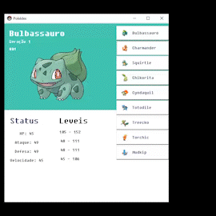

# Pokedex in Python
A program developed in Python, using the Tkinter and PIL frameworkers, in order to display a Pokedex with the initial Pokémons of the first three generations in a window. 
>Um programa desenvolvido em Python, utilizando os frameworkers Tkinter e PIL, a fim de mostrar um Pokedex com os Pokémons iniciais das três primeiras gerações em uma janela.

## Objective
The program shows the information of a given Pokémon, from the initial ones up to the third generation of the anime, simulating a Pokedex from the anime. From there, the program will present in the GUI itself, the data of this Pokémon.<br>Presenting its Status and levels:

- HP;
- Attack;
- Defense;
- Speed.


>O programa mostra as informações de um determinado Pokémon, dentre os iniciais até a terceira geração do anime, simulando uma Pokedex do Anime. A partir daí, o programa apresentará na própria GUI, os dados desse Pokémon.<br>Apresentando os Status e os leveis:
>- HP;
>- Ataque;
>- Defesa;
>- Velocidade.

## Instructions
- Open your terminal, install the Tkinter;
>Abra o seu terminal, instale o Tkinter.
```txt
pip install tkinter 
```
- Next, install the "pillow";
>A seguir, instale o "pillow";
```txt
pip install pillow 
```
- After that, install the "turtle";
>após isso, instale o "turtle";
```txt
pip install turtle 
```
- At the end, run the program "main.py" in cmd or in an IDE;
- Have fun. ;)
>No final, execute o programa "main.py" no cmd ou em uma IDE;
><br>Divirta-se;)

## Final Result

